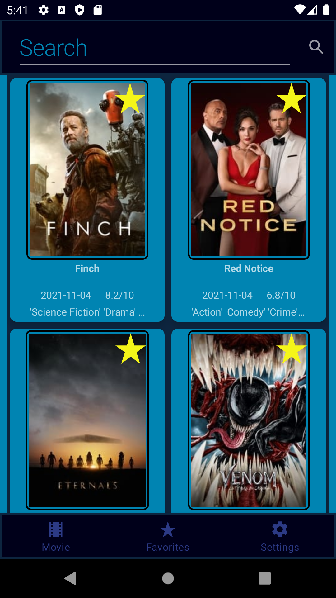
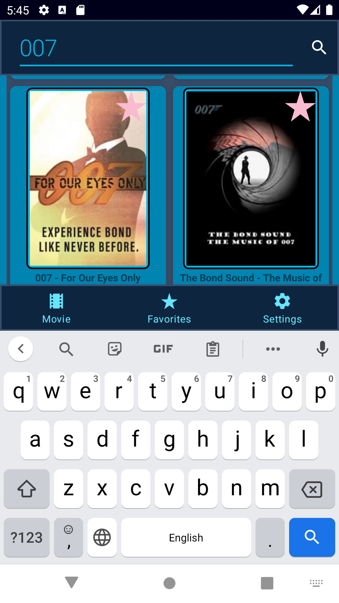
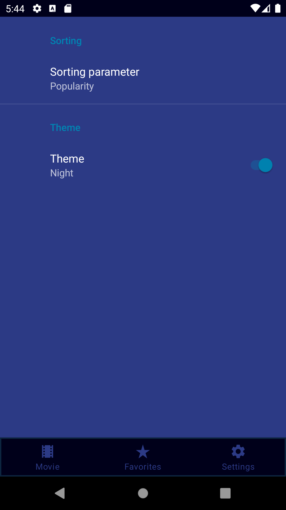
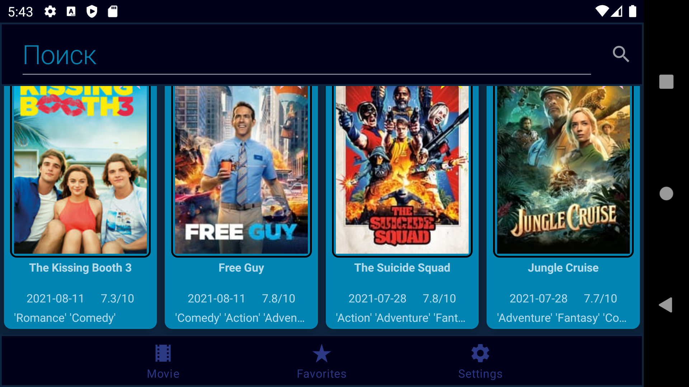
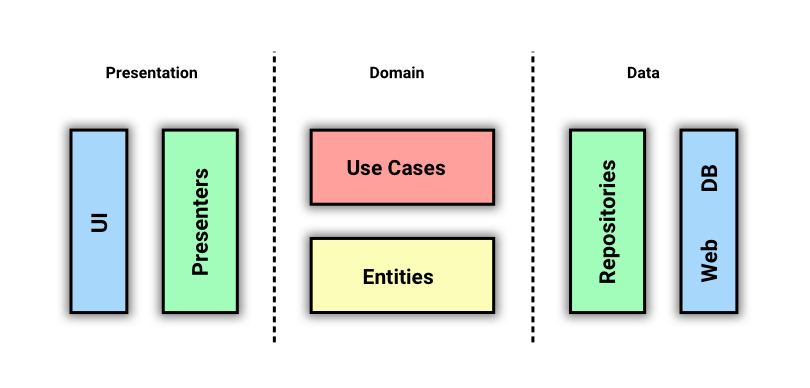

<h1>TMDb</h1>
------

TMDb is a application to show list of movies on Android, built using Kotlin with Clean Architecture concepts

## Screenshots
------
<p>





</p>

## Prerequisites
------
Add your [TMDB](https://www.themoviedb.org/) API key in the `local.properties` file:
```
api_key=YOUR_API_KEY
```
## Features
------

- Search for movies
- View movie details like release date, rating, overview
- Adding movies to favorites
- Change dark and light themes in the settings
- Works offline by caching data into a database.

## Architecture
------

<p>

</p>

## Technologies
------

- [Kotlin](https://kotlinlang.org/) - %100 Kotlin
-  Architecture Components:
   - [View Binding](https://developer.android.com/topic/libraries/view-binding)
   - [ViewModel](https://developer.android.com/topic/libraries/architecture/viewmodel)
   - [Paging 3](https://developer.android.com/topic/libraries/architecture/paging/v3-overview)
   - [Navigation](https://developer.android.com/guide/navigation)
- [Coil](https://github.com/coil-kt/coil) for image loading
- [Coroutines](https://github.com/Kotlin/kotlinx.coroutines) for asynchronous operations
- [StateFlow](https://kotlin.github.io/kotlinx.coroutines/kotlinx-coroutines-core/kotlinx.coroutines.flow/-state-flow/)
- [ViewModel](https://developer.android.com/topic/libraries/architecture/viewmodel) and [LiveData](https://developer.android.com/topic/libraries/architecture/livedata)
- [Dagger Hilt](https://developer.android.com/training/dependency-injection/hilt-android) for Dependency Injection
- [OkHttp](https://github.com/square/okhttp) and [Retrofit](https://github.com/square/retrofit) for network operations
- [TheMovieDb(Tmdb) Api](https://developers.themoviedb.org/3) for movies
